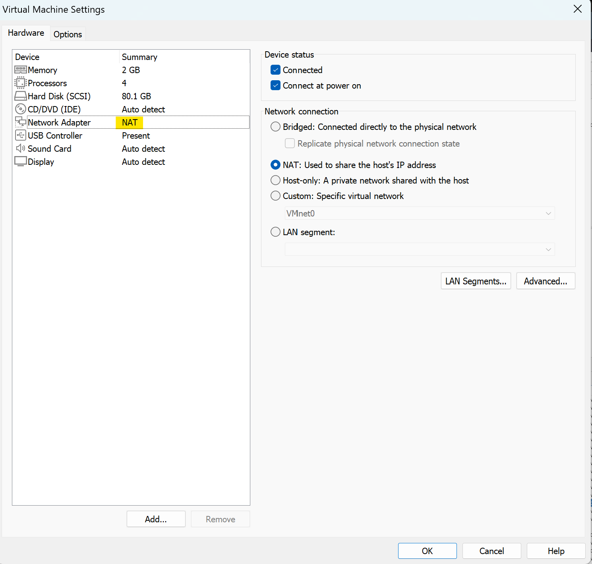
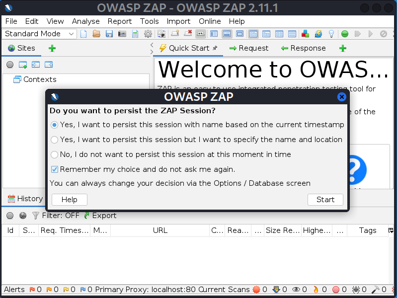
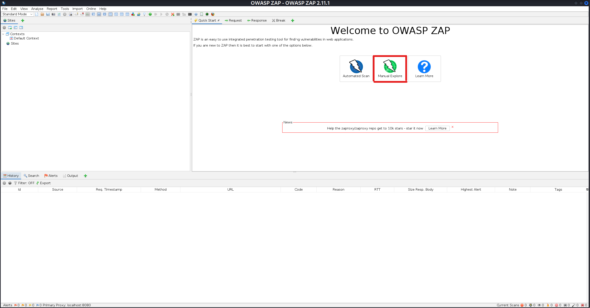
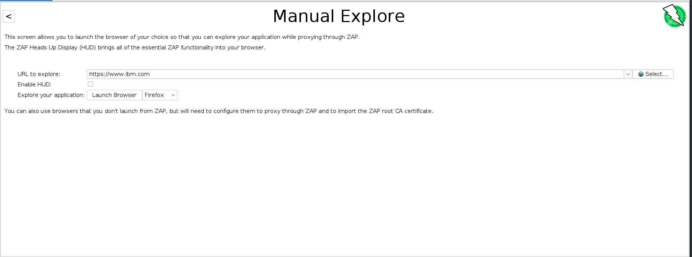
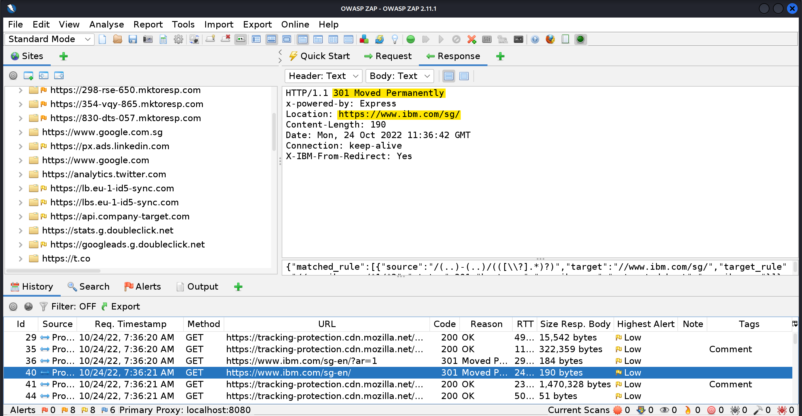
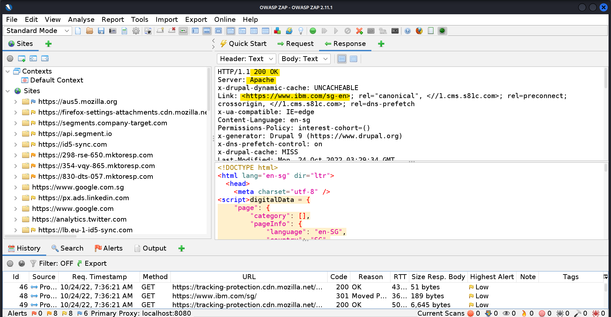

# Activity 1

When a pen-tester point the URL of his Firefox browser to https://www.ibm.com

The communications between his browser and the IBM servers were captured and given in the next five slides, separate them as `REQUEST` or `RESPONSE` message. 

Using the `ZAP Proxy Tool`, show the intercepted HTTP Request and Response Header

---

## OWASP ZAP Proxy

1. Ensure Kali VM is in `NAT`

  

2. Start an OWASP ZAP Proxy Session

  

3. Start a `Manual Exploration`

  

4. Key in the website to manually explore

  

5. Notice the browser information is captured by the server in the `REQUEST` and the `RESPONSE` is a redirect status code

#### HTTP Request

  

#### HTTP Response

 

6. Notice that within the packet of the Redirect status code there is another redirect status code in the `RESPONSE`

  

7. Notice that within the packet of the Redirect status code there is another redirect status code in the `RESPONSE`

  

8. Notice that within the packet of the Redirect status code there is another redirect status code in the `RESPONSE`

  

9. Notice on recieving a `200 OK` status code, the server type, link and the html code is returned

  

# Additional Resources
1. [Types of VM Network connections](https://docs.vmware.com/en/VMware-Workstation-Pro/16.0/com.vmware.ws.using.doc/GUID-3B504F2F-7A0B-415F-AE01-62363A95D052.html)
2. [HTTPS Status Codes and their meanings](https://www.webfx.com/web-development/glossary/http-status-codes/)
3. [HTTPS Server Redirection - How it works](https://developer.mozilla.org/en-US/docs/Web/HTTP/Redirections)